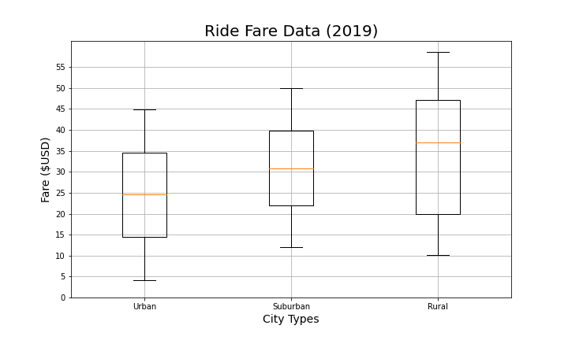

# PyBer Analysis

## Overview of Project

### Purpose
Pyber is a Python based ride-sharing app company and this project's purpose is to performe an exploratory analysis on data in csv files. We will create several types of visualizations to aid the CEO's company to have an outlook for:
* The relationship bet

### Results

The initial code that we developed ran the analysis in .82 seconds for 2017 and in .73 for 2018 so after refactoring the code we could have an improvement as we see in the next screenshots:

Code performance por 2017

Code performance por 2018

Code performance por 2018

Code performance por 2018

